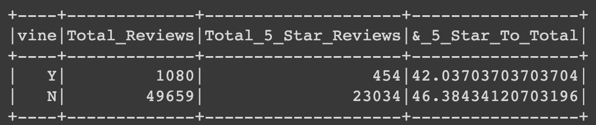

# Amazon_Vine_Analysis
ETL AWS

## Overview of the analysis 
The purpose of this project is to analyze Amazon's vine program through Big Data and Cloud services - Spark and AWS.
First I performed an ETL process in the cloud and uploaded some dataframes to an RDS, secondly an statistical analysis.

## Results 

* How many Vine reviews and non-Vine reviews were there?

Vine reviews are 1,080.
non-Vine reviews are 49659.

* How many Vine reviews were 5 stars? How many non-Vine reviews were 5 stars?

5 Star Vine reviews - 454 of 1,080
5 Star Non-Vine reviews - 23,034 of 49,659 

* What percentage of Vine reviews were 5 stars? What percentage of non-Vine reviews were 5 stars?

42% of the Vine reviews were rated 5 stars
46% of the Non-Vine reviews were rated 5 stars 

## Summary 

After reviewing and comparing all this data it can be assumed that the customers don't seem to have a positive thinking for leaving good reviews. This describes a short negative bias. However in order to support this assumptions further we need to add more data and calculations such as statistical distribution (mean, median and mode).

